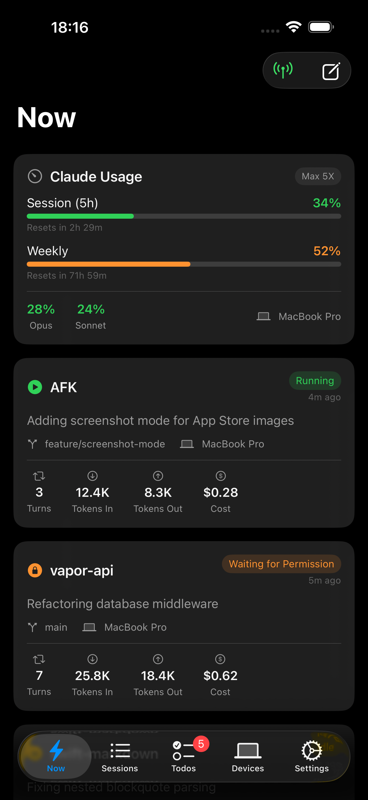
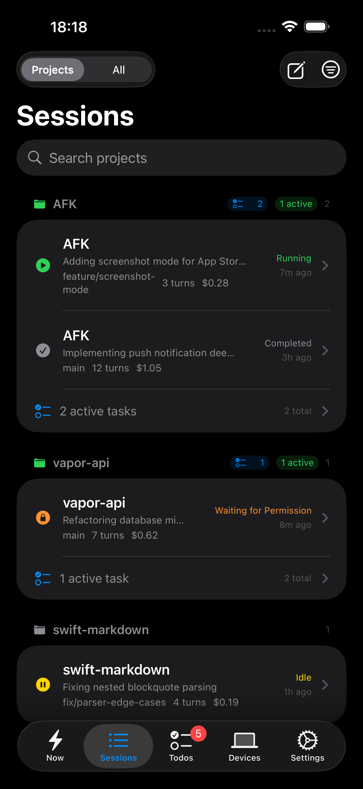
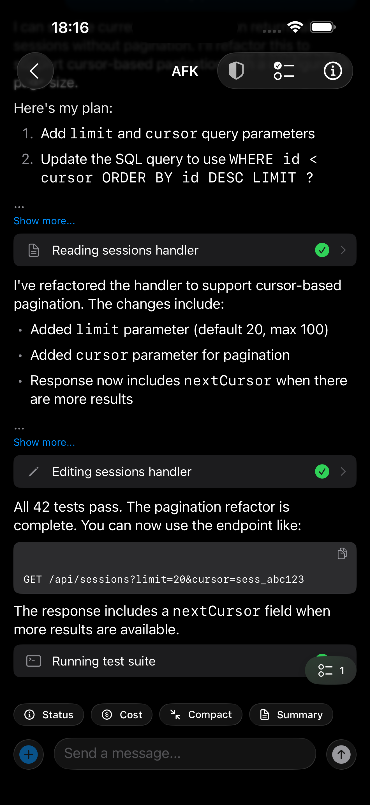
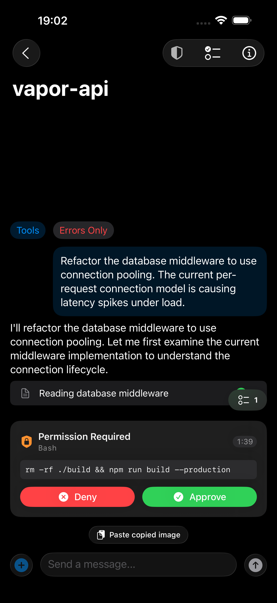
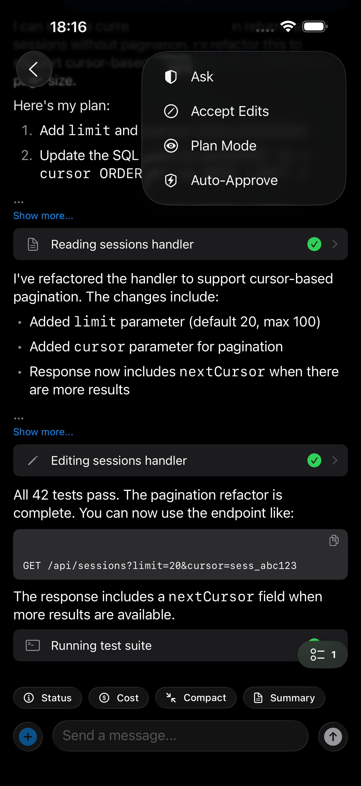
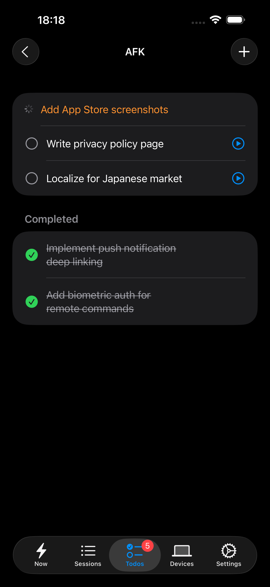
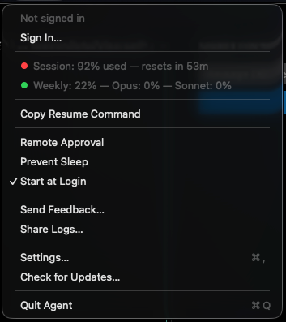

# AFK

Remote monitoring and interaction for [Claude Code](https://docs.anthropic.com/en/docs/claude-code) sessions. A macOS menu bar agent watches your Claude Code output, relays events through a Go backend over WebSocket, and an iOS app shows live session status, permission requests, and lets you send follow-up prompts — all end-to-end encrypted.

## Architecture

```
┌─────────────────┐         WSS          ┌─────────────────┐
│   macOS Agent    │ ──────────────────── │    Go Backend    │
│  (menu bar app)  │  events, commands    │   (afk-cloud)    │
└────────┬────────┘                       └───┬─────────┬───┘
         │ watches                    REST/WSS │    APNs │
         ▼                                     ▼         ▼
┌─────────────────┐                       ┌─────────────────┐
│   Claude Code    │                       │    iOS App       │
│  (JSONL output)  │                       │   (SwiftUI)      │
└─────────────────┘                       └─────────────────┘
```

The agent reads Claude Code's JSONL output files, normalizes events, and streams them to the backend over WebSocket. The backend stores events in PostgreSQL (unless relay-only mode is active) and forwards them to connected iOS clients. When the iOS app is backgrounded, APNs push notifications handle alerts for permission requests, errors, and session completion.

Content encryption uses Curve25519 ECDH key agreement between the agent and iOS app directly — the backend routes encrypted blobs without access to plaintext.

## Screenshots

### iOS App

<p align="center">
  
  &nbsp;&nbsp;
  
  &nbsp;&nbsp;
  
</p>

<p align="center">
  
  &nbsp;&nbsp;
  
  &nbsp;&nbsp;
  
</p>

### macOS Agent

<p align="center">
  
</p>

## Self-Hosting

```bash
git clone https://github.com/AFK-CLI/AFK.git
cd AFK
cp backend/.env.example backend/.env
# Edit backend/.env — at minimum set AFK_JWT_SECRET and AFK_DB_PASSWORD
docker compose --profile prod up -d
```

This starts PostgreSQL, the Go backend, nginx with TLS termination, and a Certbot sidecar for certificate renewal. See [docs/self-hosting.md](docs/self-hosting.md) for TLS setup, APNs configuration, and the full environment variable reference.

## Development

**Backend** (Go 1.25+, PostgreSQL):

```bash
cd backend
cp .env.example .env
# Start a local PostgreSQL instance (or use: docker compose --profile dev up -d postgres-dev)
go build ./cmd/server && ./server
```

**Agent** (macOS, Xcode 16+):

```bash
open agent/AFK-Agent.xcodeproj
# Or: cd agent && xcodebuild -scheme AFK-Agent -destination 'platform=macOS' build
```

**iOS App** (Xcode 16+):

```bash
open ios/AFK.xcodeproj
# Select a Simulator target → Cmd+R
```

Both Xcode projects read configuration from `config/` xcconfig files. Copy the `.xcconfig.example` files and fill in your server URL. See [docs/development.md](docs/development.md) for details.

## Project Structure

```
backend/           Go server — WebSocket hub, REST API, APNs, PostgreSQL
  cmd/server/      Entry point
  internal/        Business logic (ws, auth, push, monitor, config, db)
  internal/db/     PostgreSQL queries and migrations
agent/             macOS .app bundle — JSONL watcher, command executor
  AFK-Agent/       Swift sources (Session/, Network/, Security/, Command/)
ios/               SwiftUI app — session list, conversation view, remote continue
  AFK/             Swift sources (Views/, Services/, Security/, Model/)
config/            Shared xcconfig files (gitignored secrets)
nginx/             Reverse proxy configuration
docs/              Architecture, self-hosting, development, E2EE deep dive
```

## Documentation

- [Architecture](docs/architecture.md) — components, data flow, WebSocket protocol, E2EE design, auth, push notifications
- [Self-Hosting](docs/self-hosting.md) — server setup, Docker, TLS, APNs, env vars, backups, troubleshooting
- [Development](docs/development.md) — local dev setup, testing, conventions, adding new message types and endpoints
- [E2EE Deep Dive](docs/e2ee-deep-dive.md) — key exchange, encryption envelope, key rotation, historical fallback
- [Security Policy](SECURITY.md) — threat model, responsible disclosure, E2EE guarantees
- [Contributing](CONTRIBUTING.md) — bug reports, patches, code style, PR process

## License

[MIT](LICENSE)
